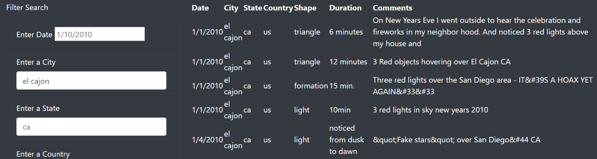
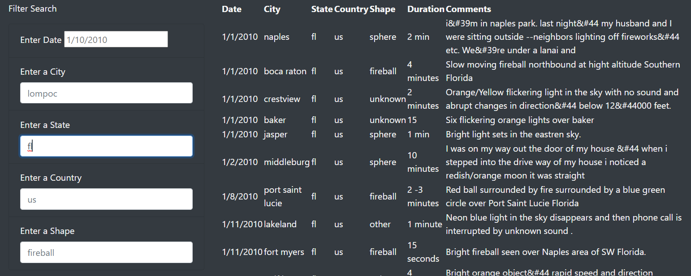

# UFO Sightings: An analysis 

Are we really alone in the universe?  In this challenge we were tasked with making a html page for journalist Dana, covering her enthusiasm for UFO sightings. She has a JavaScript file with some data of sightings and an article from an UFOlogist that she wants to include. The page is to be interactive with filters to be user friendly. A great beginning to what can become a large database of articles and recordings of UFO sightings.

### The mysteries of searching for sightings

At this time the website is pretty simple with easy searches and information being available as soon as you type in your search.  We made available five filters, one for date, city, state, country, and shape of sighting. The websites illustrates how the user is to input the search parameters and then press enter. There is no need to include more than one search in order to get results, if all you have is a city, that's all the information that needs to be input to get results of all the sightings in that city.

The information that was received from the data file was all lower case and as so the user will need to input search requests in lower case, as illustrated for state and country in the images below.

The site also recognizes numbers and the formatting of the date so the user should feel comfortable inputting dates in as indicated in the placeholder that shows on the site. There is no need to fill in empty spaces with zeros as the code will recognize single digit months and days (i.e. 1/2/2010 does NOT need to be input 01/02/2010).  All in all, this is a great beginning to a database for UFO enthusiasts like Dana.

### Possibilities for the future

During the meeting with Ms. Dana it was implied that the data she had was large but as I was working to create this page and search filters the data was pretty small and what feels incomplete. The data presented are recordings of sightings from 1/1/2010 to 1/13/2010, it is possible that she might hold a larger database and we're using this information for testing alone. It's missing information from her home town with all the sightings in MicMinnville, OR; this was the reason for this website and there are no sightings for McMinnville.

 As for the filters, they're a great way to start. It would be great if they could auto populate and bring up maps and plotting sightings in those maps. The visualization of the UFO data would be interactive. Also if there were a button where people could input their sightings with the abilities to upload photos. It's unclear why the data Dana provides cuts-off so soon but it would be great to see the frequency with which thses sightings occur and a more global perspective. I know when I was introduced to UFO sightings was because they appeared a lot over Mexico City, MX. There is no information here outside of US, except for 2 sightings in Canada. Introducing other articles, stories and opinions would attract and relate with the reader. This has a potential of a great resource for all UFOlogists.

